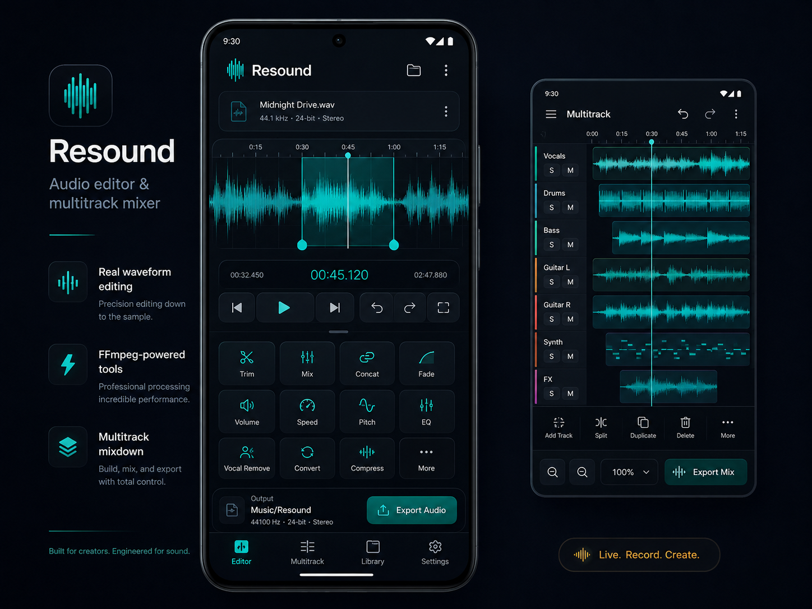

<p align="center">
  
</p>

<h1 align="center">Resound</h1>

<p align="center">
  <strong>A premium, local-first audio editor and multitrack mixer for Android.</strong><br />
  Edit, record, arrange, mix, and export — entirely on-device.
</p>

<p align="center">
  
  
  
  
</p>

<p align="center">
  <a href="https://github.com/MikereDD/Resound/releases">Releases</a> ·
  <a href="CHANGELOG.md">Changelog</a> ·
  <a href="docs/RELEASING.md">Release process</a> ·
  <a href="SECURITY.md">Security</a>
</p>

---

## What is Resound?

Resound is an Android audio workspace built for the jobs that should not require
an account, an upload, or a desktop DAW. Open local audio, record something new,
make precise edits against a decoded waveform, arrange clips on a multitrack
timeline, and export the result directly to `Music/Resound`.

The app is intentionally **local-first**:

- no account
- no advertising
- no cloud requirement
- audio processing stays on the device
- releases are distributed as signed APKs through GitHub Releases

## Premium studio interface

Resound's 0.8 development line rebuilt the application around a dark studio
interface with its signal-teal waveform identity, clearer transport controls,
real tool hierarchy, and a consistent Editor / Multitrack / Library / Settings
shell.

<p align="center">
  
</p>

## Features

### Waveform Editor

- real `MediaCodec`-decoded waveform
- draggable selection with detailed timecode
- live playhead and selection playback
- open audio or supported video through Android's system picker
- reopen exported audio directly from the Library

### Audio tools

Resound currently provides eleven FFmpeg-powered operations:

`Trim` · `Mix` · `Concat` · `Fade` · `Volume` · `Speed` · `Pitch` · `EQ` · `Vocal Remove` · `Convert` · `Compress`

Processing progress is shown in-app and completed files are published to the
shared `Music/Resound` collection.

### Recording

- one-tap voice recording
- AAC/M4A output
- recorded audio can load directly into the Editor
- recordings are retained in the Resound output library

### Multitrack

- multiple independent tracks
- colored clip lanes
- drag clips along the timeline
- visible clip-edge trim handles
- start / duration / end readout for selected clips
- synchronized horizontal scroll and zoom
- per-track mute controls
- FFmpeg mixdown export

### Library

- browse exports from `Music/Resound`
- view format, duration, size, and modified date
- refresh the collection
- share exported audio
- reopen a file directly in the Editor

### Ringtone support

Loaded audio can be published and set as the Android system ringtone.

### Secure updater

Resound includes a user-initiated sideload updater designed around signed GitHub
Release assets. Before Android is allowed to install an update, Resound verifies:

- HTTPS-only release URLs
- SHA-256 of the downloaded APK
- expected Android package name
- signing certificate match with the currently installed Resound build

There are no silent updates and no automatic downgrades.

## Project status

**Current development source:** `0.8.0-dev.6` (`versionCode 19`)

The core editing, recording, playback, ringtone, multitrack, Library, and updater
workflows are implemented and have undergone real-device testing. The current
work is release-readiness testing for the first standalone GitHub Release in the
0.8 line.

## Releases

Signed APKs are published **only through GitHub Releases**:

**https://github.com/MikereDD/Resound/releases**

APK binaries are intentionally not stored in the Git repository. The updater
manifest remains in source control while each release APK and its checksum are
attached to the corresponding GitHub Release.

Resound currently targets **arm64-v8a** devices and is intended for sideloading.

## Build from source

### Requirements

- JDK 17
- Android SDK 35
- Gradle 8.9
- AGP 8.7.2
- Kotlin 2.0.21

Build a debug APK with a locally installed Gradle:

```bash
gradle :app:assembleDebug
```

Or generate a local wrapper if preferred:

```bash
gradle wrapper --gradle-version 8.9
./gradlew :app:assembleDebug
```

The Gradle wrapper is intentionally not committed. GitHub Actions installs
Gradle 8.9 explicitly for CI builds.

## Audio engine

Resound talks to FFmpeg through `FFmpegRunner`, implemented by
`FFmpegKitRunner`, using the 16 KB page-size compatible community package:

```kotlin
implementation("com.moizhassan.ffmpeg:ffmpeg-kit-16kb:6.1.1")
```

FFmpeg and the wrapper remain under their own applicable licenses. See
[`THIRD_PARTY_NOTICES.md`](THIRD_PARTY_NOTICES.md) before redistributing builds.

## Release and update model

The production updater manifest lives at:

```text
releases/update.json
```

Release APKs do **not** live in the repository. A release manifest points to the
signed APK attached to the matching GitHub Release, for example:

```text
https://github.com/MikereDD/Resound/releases/download/v0.8.0/Resound-v0.8.0.apk
```

See [`releases/update.example.json`](releases/update.example.json) for the
manifest structure and [`docs/RELEASING.md`](docs/RELEASING.md) for the complete
release workflow.

## Repository history

Resound began inside the `It-Works-On-My-Machine` monorepository. Its
application-specific Git history was extracted into this standalone repository
with `git filter-repo` rather than restarting the project with a synthetic
initial commit.

See [`docs/MONOREPO-MIGRATION.md`](docs/MONOREPO-MIGRATION.md) for details.

## Contributing

Resound is primarily a personal project, but focused bug reports and sensible
pull requests are welcome. See [`CONTRIBUTING.md`](CONTRIBUTING.md).

For vulnerabilities or security-sensitive reports, follow [`SECURITY.md`](SECURITY.md).

## License

Resound's original source is licensed under the **Apache License 2.0**.
Third-party components retain their own licenses and notices.

See [`LICENSE`](LICENSE) and [`THIRD_PARTY_NOTICES.md`](THIRD_PARTY_NOTICES.md).

---

<p align="center">
  <strong>Resound</strong><br />
  Built by Typezer∅
</p>
